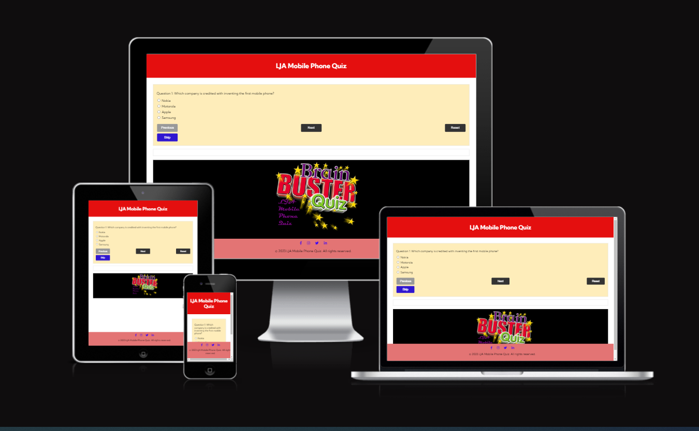
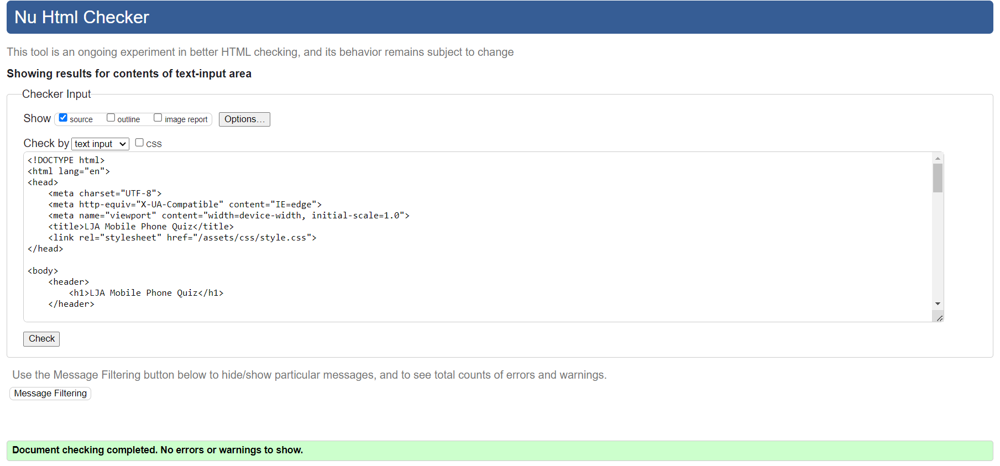
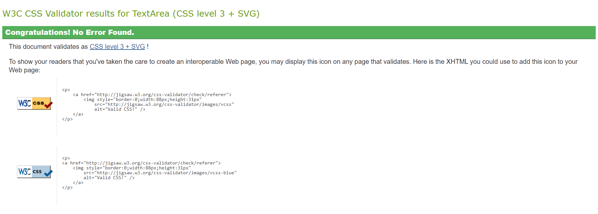
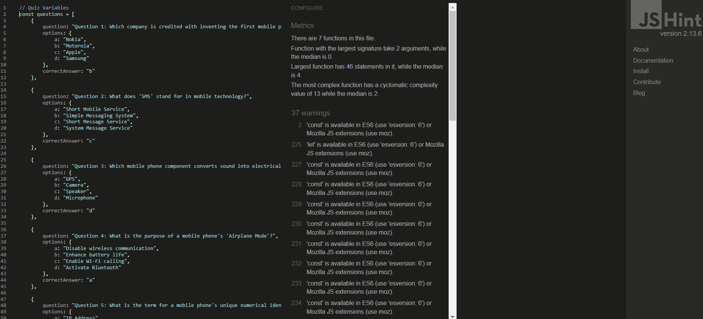
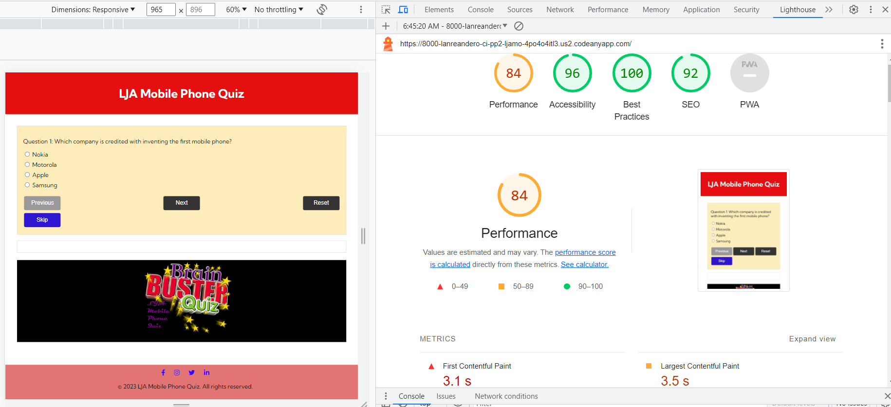
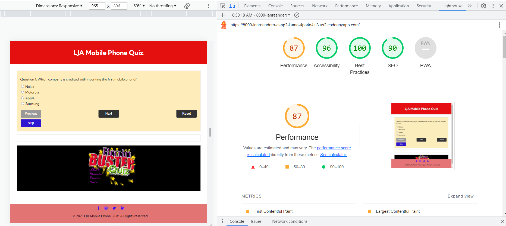

# LJA MOBILE PHONE QUIZ

This project is focuses on simplicity, interactivity, and providing users with a satisfying and engaging quiz-taking journey. The design and functionality aim to create a seamless and enjoyable experience for users interested in testing their knowledge on mobile technology.

[amiresponsive](https://ui.dev/amiresponsive?url=https://lanreandero.github.io/CI_PP2_LJAMOBILEPHONEQUIZ/)

[View LJA Mobile Phone Quiz on Github pages](https://lanreandero.github.io/CI_PP2_LJAMOBILEPHONEQUIZ/).

---

## CONTENTS

- [LJA MOBILE PHONE QUIZ](#lja-mobile-phone-quiz)
  - [CONTENTS](#contents)
  - [User Experience (UX)](#user-experience-ux)
    - [User Stories](#user-stories)
  - [Design](#design)
    - [Typography](#typography)
    - [Imagery](#imagery)
  - [Features](#features)
    - [General Features on Each Page](#general-features-on-each-page)
    - [Future Implementations](#future-implementations)
    - [Accessibility](#accessibility)
  - [Technologies Used](#technologies-used)
    - [Languages Used](#languages-used)
    - [Frameworks, Libraries \& Programs Used](#frameworks-libraries--programs-used)
  - [Deployment](#deployment)
  - [Testing](#testing)
    - [W3C Validator](#w3c-validator)
    - [Lighthouse](#lighthouse)
    - [Known Bugs](#known-bugs)
  - [Credits](#credits)
    - [Code Used](#code-used)
    - [Content](#content)
    - [Media](#media)
  - [Acknowledgments](#acknowledgments)

---

## User Experience (UX)

1. **Landing Page:**
   - Users arrive at the landing page where they are greeted with a clear title and description of the quiz topic.
   - A prominent "Start Quiz" button is displayed, inviting users to begin the quiz.

2. **Quiz Introduction:**
   - Upon clicking the "Start Quiz" button, users are taken to the first question of the quiz.
   - The question is displayed along with multiple-choice options and radio buttons for selecting an answer.

3. **Taking the Quiz:**
   - Users carefully read the question and select their answer by clicking the appropriate radio button.
   - After selecting an answer, they click the "Submit" button.

4. **Immediate Feedback:**
   - Instantly, users receive feedback on their submitted answer.
   - If their answer is correct, they see a green "Correct!" message and can move to the next question.
   - If their answer is incorrect, they see a red "Incorrect" message along with the correct answer highlighted.

5. **Navigation and Progress:**
   - Users can navigate to the next question using the "Next" button, which becomes enabled after submitting an answer.
   - They can also navigate back to the previous question using the "Previous" button (except for the first question).
   - The progress bar or question counter at the top of the screen updates to show the current question number out of the total.

6. **Time Tracking:**
   - As users progress through the quiz, the system tracks the time they spend on each question.
   - The total time spent is calculated and displayed along with the final score at the end of the quiz.

7. **Final Result:**
   - After answering all questions, users are shown their final score as a percentage and the total number of correct answers.
   - A congratulatory completion message ("Congratulations! You have completed the quiz.") is displayed.

8. **Retake or Reset:**
   - Users can choose to retake the quiz by clicking a "Retake Quiz" button, which clears their previous answers and resets the quiz.
   - They can also refresh the page or navigate back to the landing page to start the quiz again.

9. **Responsive Design:**
   - The website is responsive, adapting to different screen sizes and orientations for a consistent experience on various devices.

10. **Visual Design:**

- The website features a clean and visually appealing design with appropriate color schemes, typography, and spacing.

I. **Accessibility:**

- The website adheres to accessibility standards, ensuring that it can be used by people with disabilities using assistive technologies.

II. **Smooth Performance:**

- The website loads quickly and provides a smooth user experience, minimizing loading times and delays.

III. **User-Friendly Interface:**

- Instructions are clear and concise, guiding users through each step of the quiz-taking process.

IV. **Save Progress:**

- If users accidentally close the browser or refresh the page, their progress is saved, allowing them to continue where they left off.

### User Stories

1. **As a curious user, I want to learn about mobile technology, so I visit the quiz website to test my knowledge and              gain insights into the topic.**

2. **As a user, I want to start the quiz easily, so I can begin answering questions without any confusion.**
   - I can see a clear "Start Quiz" button on the landing page.

3. **As a quiz taker, I want to read each question carefully and select an answer that I believe is correct.**
   - I can see the question along with multiple-choice options.
   - I can select one option by clicking a radio button.

4. **As a user, I want to receive immediate feedback after submitting my answer to know whether I got it right or wrong.**
   - If my answer is correct, I see a "Correct!" message in green.
   - If my answer is incorrect, I see an "Incorrect" message and the correct answer is highlighted.

5. **As a user, I want to navigate between questions and see my progress as I move through the quiz.**
   - I can use the "Next" button to move to the next question.
   - I can use the "Previous" button to go back to the previous question.
   - The progress bar or question counter updates as I go through the questions.

6. **As a user, I want to see the time I'm spending on each question and the total time spent on the quiz.**
   - The time spent on each question is tracked and displayed.
   - The total time spent on the quiz is shown at the end.

7. **As a user, I want to know my final score and the number of correct answers I got.**
   - After completing the quiz, I see my final score as a percentage.
   - I see the total number of correct answers out of the total questions.

8. **As a user, I want to receive a congratulatory message when I complete the quiz successfully.**
   - I see a "Congratulations! You have completed the quiz." message at the end.

9. **As a user, I want the option to retake the quiz to improve my score or challenge myself again.**
   - I can click a "Reset" button to start the quiz over.

10. **As a user, I want the website to be responsive and visually appealing on different devices.**
    - The website layout adjusts to fit different screen sizes, ensuring a good experience on mobile, tablet, and desktop.

11. **As a user, I want clear instructions and user-friendly buttons that guide me through the quiz-taking process.**
    - Instructions for each step are easy to understand.
    - Buttons like "Submit," "Next," and "Previous" are prominently displayed and labeled.

12. **As a user, I want the website to load quickly and provide a smooth experience without lag or delays.**
    - The website loads without significant waiting times between questions or interactions.

13. **As a user, I want the website to adhere to accessibility standards so that it's usable by people with disabilities.**
    - The website is designed with accessibility features, making it usable with assistive technologies.

14. **As a user, I want a visually pleasing design with appropriate colors, fonts, and spacing to enhance my overall experience.**
    - The website's design is visually appealing and user-friendly, creating an enjoyable experience.

## Design

### Typography

'Kumbh Sans' is a modern and versatile sans-serif font that brings a perfect balance between elegance and readability. Created with careful attention to detail, this font-family is the epitome of minimalistic sophistication. Whether used for headlines or body text, 'Kumbh Sans' effortlessly complements various design styles, making it a popular choice for both digital and print media.

Characteristics:
The 'Kumbh Sans' font-family boasts a clean and crisp design, characterized by its geometric shapes and smooth curves. It exudes a sense of confidence and professionalism while maintaining a friendly and approachable demeanor. With its sans-serif nature, 'Kumbh Sans' offers a contemporary appeal, making it suitable for projects that require a sleek and modern aesthetic.

Weights and Styles:
'Kumbh Sans' comes in a range of weights, from thin and light to bold and extra-bold, allowing designers to create visual hierarchy and add emphasis as needed. Additionally, it offers various styles, including regular, italic, and oblique, to accommodate diverse typographic needs.

Versatility:
One of the most outstanding features of 'Kumbh Sans' is its versatility. Whether you're designing a website, a poster, a magazine, or a logo, this font-family adapts effortlessly to any medium or layout. Its legibility remains intact even at smaller sizes, making it an excellent choice for body text.

Use Cases:

1. Headlines and Subheadings:
    The bold and eye-catching characteristics of 'Kumbh Sans' are ideal for headlines and subheadings, instantly grabbing the reader's attention and guiding them through the content.

2. Body Text:
    When used for body text, 'Kumbh Sans' provides an enjoyable reading experience with its balanced letterforms and generous spacing.

3. Branding:
    'Kumbh Sans' can lend a touch of professionalism and elegance to brand logos, giving them a timeless appeal.

4. User Interfaces (UI):
    Due to its legibility and contemporary style, 'Kumbh Sans' is an excellent choice for user interfaces, providing a seamless and engaging user experience.

5. Pairing:
    'Kumbh Sans' pairs exceptionally well with both serif and other sans-serif fonts. For a classic look, consider pairing it with a timeless serif font like 'Georgia' or 'Times New Roman.' To create a modern and harmonious combination, pair 'Kumbh Sans' with another sans-serif font such as 'Roboto' or 'Montserrat.'

In conclusion, the 'Kumbh Sans' font-family stands out as a versatile and elegant choice for a wide range of design projects. Its clean lines, balanced proportions, and extensive font weights make it a reliable companion for any typographic endeavor, infusing sophistication and clarity into your designs.

[Google Fonts](https://fonts.google.com/) is a popular choice for importing fonts to use in your project, as it doesn't require you to download the fonts to use them.

### Imagery

The images were used with the permission of their owners. All images were taken from the websites. I have credited these in the credits section.

I used this because it showed users can really test their knowledge on mobile phones technology.

## Features

### General Features on Each Page

1. Home Page:
    Attractive and responsive landing page design.
    Eye-catching question container with high-quality onclick function buttons.
    Featured a brain buster image.
    Easy to use navigation and reset buttons.
    Social media integration to showcase quiz updates and engage with users.
    Feedbcks and notifications for interactiveness

Additional Features:
  Responsive design that adapts to different devices, including mobile phones and tablets.
  Accessibility features to ensure the website is usable by people with disabilities.

### Future Implementations

1. Use javascript to construct and display images dynamically.
2. Clear radio button at completion of the quiz.

### Accessibility

I have been mindful during coding to ensure that the website is as accessible friendly as possible. I have achieved this by:

1. Using semantic HTML.
2. Using descriptive alt attributes on images on the site.
3. Providing information for screen readers where there are icons used and no text
   & footer icons.
4. Ensuring that there is a sufficient colour contrast throughout the site.
5. Ensuring menus are accessible by marking the current page as current for screen
   readers.

## Technologies Used

### Languages Used

HTML and CSS were used to create this website.

JavaScript - was used for button onclick functionality, display question text and answer options, check attempts,display feedbacks, calculate and display scores and time spent, display correct and incorrect answers reset and reload quiz.

### Frameworks, Libraries & Programs Used

Balsamiq - Used to create wireframes.

Git - For version control.

Github - To save and store the files for the website.

Google Fonts - To import the fonts used on the website.

Font Awesome - For the iconography of social media links on the website.

Google Dev Tools - To troubleshoot and test features, solve issues with responsiveness and styling.

[Tiny PNG](https://tinypng.com/) To compress images.

[Birme](https://www.birme.net/) To resize images and change to webp format.

[Am I Responsive?](https://ui.dev/amiresponsive) To show the website image on a range of devices.

## Deployment

Github Pages was used to deploy the live website. The instructions to achieve this are below:

1. Log in (or sign up) to Github.
2. Find the repository for this project, CI_PP2_LJAMOBILEPHONEQUIZ.
3. Click on the Settings link.
4. Click on the Pages link in the left hand side navigation bar.
5. In the Source section, choose main from the drop down select branch menu. Select
   Root from the drop down select folder menu.
6. Click Save. Your live Github Pages site is now deployed at the URL shown.

## Testing

### W3C Validator

The W3C validator was used to validate the HTML on all pages of the website. It was also used to validate CSS in the style.css file. There were no error reported.

### Lighthouse

I used Lighthouse within the Chrome Developer Tools to allow me to test the performance, accessibility, best practices and SEO of the website. The results of all pages of the website in mobile and desktop mode are as below.

### Known Bugs

Radio button for answer option remained uncleared after completion of the quiz.

## Credits

### Code Used

[Guil Hernandez](https://teamtreehouse.com/profiles/guil) for his tutorials on build arrays in Javascript

### Content

Content for the website was written by me.

### Media

I would like to give credit to [Google](https://www.google.com) for the free images used throughout the website. The home page image of quiz-banner on the home page.
  
## Acknowledgments

I would like to express my sincere gratitude to [Mo Shami and Daisy Mc Girr](Mentors at Code Institute) for their invaluable guidance and support throughout the development of this project. Their expertise, insightful feedback, and encouragement were instrumental in shaping the direction of this work. I am truly grateful for the time they dedicated to answering my questions and providing me with valuable insights. This project would not have been possible without their assistance.
